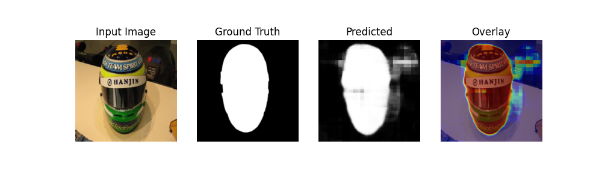
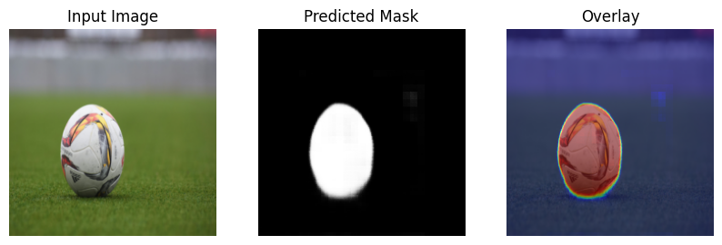

# Salient Object Detection (SOD) Project

## Overview

This project implements a complete **end-to-end Salient Object Detection (SOD) system** using deep learning.
The goal is to automatically identify and segment the most visually important object in an image. The system includes data preprocessing, model training, evaluation, and a demo for real-time inference.

---

## Dataset

* **Dataset used:** [DUTS Dataset](https://www.kaggle.com/datasets/balraj98/duts-saliency-detection-dataset) (DUTS-TR + DUTS-TE merged) --> Merge
* **Total images:** 15,572
* **Total masks:** 15,572
* **Train/Validation/Test split:** 70% / 15% / 15%
* **Preprocessing & Augmentation:**

  * Resize to 224×224
  * Normalize images to [0,1]
  * Convert masks to single-channel grayscale
  * Training augmentations: Random horizontal & vertical flip, Color jitter, Random rotation ±15°

---

## Model Architecture

* **Encoder:**

  * 5 convolutional blocks (Conv → BatchNorm → ReLU → MaxPool)
  * Dropout after major layers
  * 2 extra Conv layers for deeper feature extraction
* **Decoder:**

  * Multiple ConvTranspose layers for upsampling
  * Conv → BatchNorm → ReLU after each upsampling
  * Dropout for regularization
  * Final 1×1 Conv outputs a 1-channel mask
  * Sigmoid activation for pixel-wise probabilities

---

## Training

* **Loss function:** BCE + 0.5 × (1 – IoU)
* **Optimizer:** Adam (lr = 1e-3)
* **Epochs:** 20
* **Batch size:** 8
* **Metrics logged:** Loss, IoU, Precision, Recall, F1
* **Best model:** Saved based on lowest validation loss
* **Improvements:** BatchNorm, Dropout, extra Conv layers, stronger augmentations (vertical flip, color jitter)

---

## Evaluation

* **Test set metrics:**

  * IoU: 0.7079
  * Precision: 0.7853
  * Recall: 0.8699
  * F1: 0.8044
  * MAE: 0.0958
* **Visualizations:** Input image, ground truth mask, predicted mask, overlay
- Sample: 
---

## Demo

* A `run_demo(image_path)` function is implemented to showcase **real-time predictions**.
* Shows the input image, predicted mask, and overlay visualization.
- Demo Ball Prediction: 
---

## Files

* `data_loader.py` – Dataset loading, preprocessing, and augmentation
* `sod_model.py` – CNN encoder-decoder architecture
* `train.py` – Training and validation loop
* `evaluate.py` – Evaluation metrics and visualization
* `demo_notebook.ipynb` – Demo for real-time inference

---

## Notes

* Keep in mind that I used the DUTS dataset downloaded from Kaggle but I merged all test-train images and maskes into 1 folder => Merge --> Images/ Masks/
